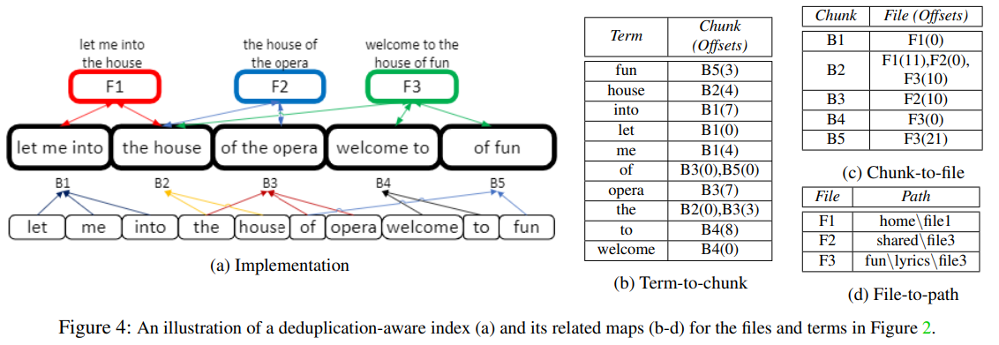
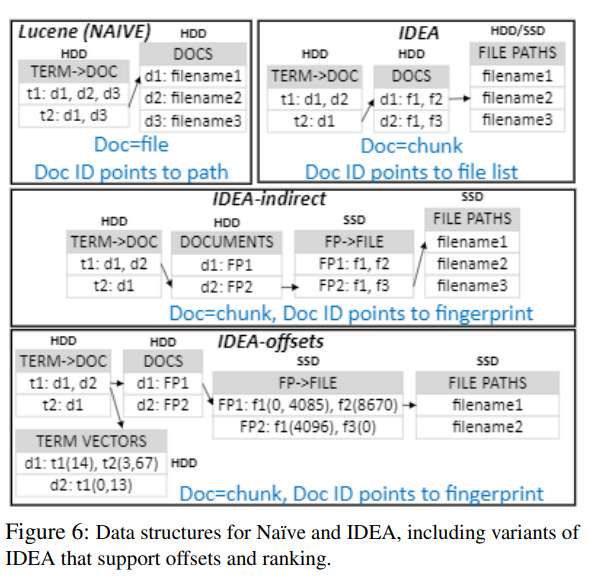
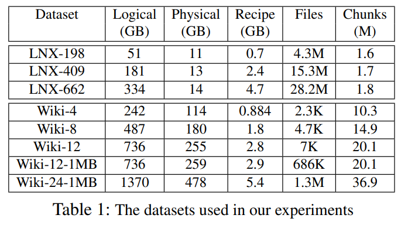

# Physical vs. Logical Indexing with IDEA: Inverted Deduplication-Aware Index

|           Venue            |       Category       |
| :------------------------: | :------------------: |
| FAST'24 | Deduplicated System Design, Post-Deduplication Management |
[TOC]

## 1. Summary
### Motivation of this paper

- motivation
  - indexing deduplicated data might result in extreme inefficiencies
    - index size
      - proportion to the logical data size, **regardless of its deduplication ratio**
        - each term must point to all the files containing it, <u>**even if the files' content is almost identical**</u>
    - index creation overhead
      - random and redundant accesses to the physical chunks
    -  **term indexing** is not supported by any deduplicating storage system
      - focus on **textual data**
      - VMware vSphere and Commvault only support file indexing
        - identifies individual files within a backup based on metadata
      - Dell-EMC Data Protection Search
        - support full content indexing
          - warn: processing the full content of a large number of files can be **time consuming**
            - recommend performing targeted indexing on **specific backups and file types**
- challenge
  - two separate trends
    - the growing need to process **cold data** (e.g., old backups)
      - e.g., full-system scans, keyword searches --> deduplication-aware search
    - the growing application of deduplication on primary storage of hot and warm data
      - e.g., perform single-term searches for files within deduplicated personal workstation
  - indexing software on file-system level --> **unaware** of the underlying deduplication at the storage system
    - index size
      - increase --> increase the latency of lookups
    - index time
      - scan all files in the system --> random IOs, high read amplification
    - split terms
      - chunking process will likely split the incoming data into chunks (at **arbitrary position**)
        - splitting words between adjacent chunks

### IDEA

- 

- key idea
  - map terms to the unique physical chunks they appear in
    - instead of the logical documents (disproportionately high)
    - replace term-to-file mapping with
      - term-to-chunk map
      - chunk-to-file map (file ID)
  - only need to modify chunking process in deduplication system
    - **white-space aware** --> enforce chunk boundaries only between words
- white-space aligned chunking
  - content-defined chunking
    - **continue scanning** the following characters until a white-space character is encountered
  - fixed-size chunking
    - **backward scanning** this chunk until a white-space character is encountered
      - resulting chunks are always smaller than the fixed size --> can be stored in a single block
    - can trim the block in memory to chunk boundary
  - non-textual content
    - only to chunking of **textual content**
    - identify textual content by the file extension of the incoming data
      - .c, .h, and .htm
    - add a Boolean field to the metadata of each chunk in the file recipe and container
      - only process chunks marked as textual
- term-to-chunk mapping
  - number of documents in the index --> number of physical chunks
    - might be higher than the number of logical files
    - chunks are **read sequentially**, each chunk is processed only once
      - processing chunks is easily parallelizable

  - lookup
    - return the fingerprints of the chunks this term appears

- chunk-to-file mapping
  - two complementing maps
    - chunk-to-file map
      - chunk fingerprint --> file IDs
    - file-to-path map
      - file IDs --> file's full pathname
  - created from the metadata in the file recipe

- keyword/term lookup
  - step-1: yield the fingerprints of all the relevant chunks
  - step-2: a series of lookups in the chunk-to-file map
    - retrieves the IDs of all files containing these chunks
  - step-3: a lookup of each file ID in the file-to-path map
    - returns the final list of file names
- ranking results
  - extend IDEA to support document ranking with the TF-IDF metric

### Implementation and Evaluation

- implementation
  - LucenePlusPlus + Destor
    - use Lucene term-to-doc map
    - 
    - scan all file receipes from Destor
      - create the list of files containing each chunk using a key-value store
    - use an SSD for the data structures which are external to Lucene
- experimental setup
  - trace
    - 

  - hardware
    - maps of all index alternatives were stored on a separate HDD
    - chunk-to-file and file-to-path maps of IDEA were stored on a SSD

- evaluation
  - baseline
    - traditional deduplication-oblivious indexing (Naive)

  - indexing time
    - the reduction is proportional to the **deduplication ratio** 
      - recipe-processing time is negligible compared to the chunk-processing time

    - indexing time of IDEA is shorter than that of Naive by 49% to 76%

  - index size
    - Naive must record more files for all the terms include in them
    - IDEA additional information is recorded per chunk, not per term

  - lookup times
    - is faster than Naive by up to 82%
    - smaller size of its term-to-doc map
      - incur shorter lookup latency

  - IDEA overhead
    - IDEA has no advantage when compared to deduplication-oblivious indexing
      - additional layer of indirection incurs **non-negligible overheads are masked** <u>where the deduplication ratio is sufficiently high</u>

## 2. Strength (Contributions of the paper)

- first design of a deduplication-aware term index
- implementation of IDEA on Lucene
  - open-source single-node inverted index used by the Elasticsearch
- extensive evaluation

## 3. Weakness (Limitations of the paper)

- trace is not very large
- files containing compressed text (.pdf, .docx)
  - their textual content can only be processed after the file is opened by a suitable application or converted by a dedicated tool
  - individual chunks cannot be processed during offline index creation

## 4. Some Insights (Future work)

- deduplication scenarios
  - backup and archival systems
    - log-structured manner: chunk --> containers
    - content-defined chunking
  - primary (non-backup) storage system and appliances
    - support direct access to <u>individual chunks</u>
    - fixed-sized chunking
      - align the deduplicated chunks with the storage interface
- deduplication data management
  - implicit sharing of content between files, complicates the followings: transforms logically-sequential data accesses to random IOs in the underlying physical media
    - GC
    - load balancing between volumes
    - caching
    - charge-back
- term indexing: **term-to-file** indexing (map)
  - 
  - return the files containing **a keyword** or **term**
    - search engines, data analytics
    - searched data might be deduplicated
    - e.g. Elasticsearch
      - built on top of the single-node Apache Lucene
        - based on a hierarchy of skip-lists
      - other variations
        - Amazon OpenSearch, IBM Watson
  - keyword: any searchable strings (natural language words)
  - query
    - the list of files containing this keyword
    - optional: byte offsets in which the term appears
  - indexing creation
    - collect the documents
    - identify the terms within each document
    - normalize the terms
    - create the list of documents, and optionally offsets, containing each term
  - result ranking
    - using a **scoring formula** on each result
    - TF-IDF
      - 
- deduplication basic
  - file recipe
    - a list of chunks' fingerprints, their sizes
    - restore: locate the chunk by searching in the fingerprint map or cache of its entries
  - pack the **compressed data** into containers
- standard storage functionality
  - can be made more efficient by taking advantage of deduplicated state
